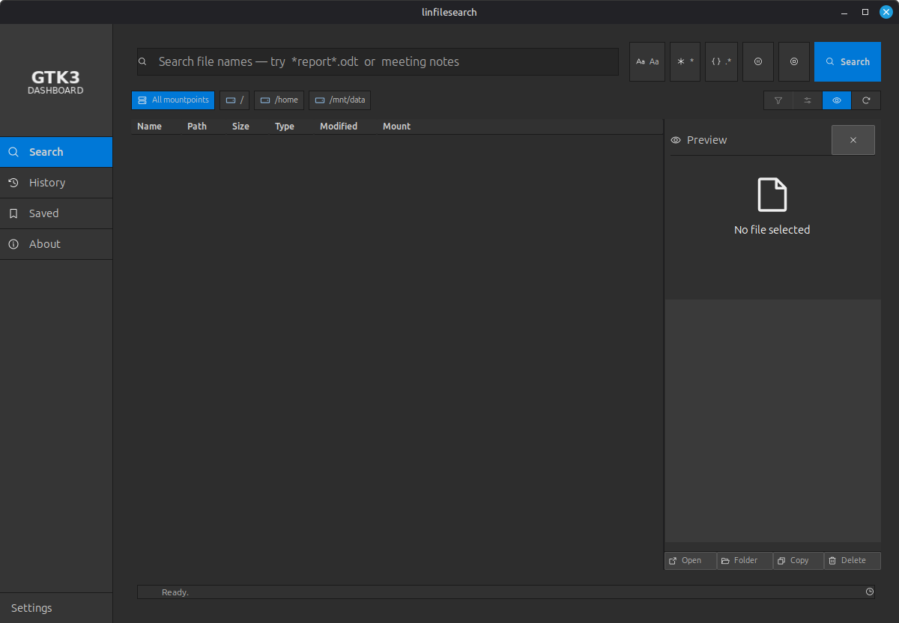

# linfilesearch



A native Linux desktop file-search utility built with GTK3 and Python.
It searches **all mounted filesystems** — the system root, the home partition,
permanently mounted data disks, and externally attached USB drives — without an
index, streaming results live with pause/stop control.

Built on [gtk-python-dashboard-starter](https://github.com/mikesdatawork/gtk-python-dashboard-starter)
(mikesdatawork). UI icons: [Phosphor Icons](https://phosphoricons.com/) (MIT).

## Features

- Name search with three modes: substring, wildcard (`* ? [ ]`, `find -name`
  semantics), and regular expressions — plus a case-sensitivity toggle
- Scope selection per mountpoint (device class + capacity shown), with
  live mount/umount awareness
- Streaming results (name, path, size, type, modified, mountpoint) in a
  sortable table with drag-reorderable columns
- Collapsible preview pane: metadata, text snippet, open / show-in-folder /
  copy path / trash actions
- Search history: every run recorded; single-click a former search to
  re-run it with all criteria prepopulated; bookmark any entry to Saved
- Seven dark themes inherited from the starter framework

## Running

```bash
python3 src/main.py          # system python3 with PyGObject (GTK 3)
```

or `./run.sh` (creates a venv and installs `requirements.txt`).

## Installation

User-level install (no root required) — installs the application icon set,
a `linfilesearch` command in `~/.local/bin`, and a menu entry with correct
taskbar/ALT+TAB grouping:

```bash
./install.sh                # install
./install.sh --uninstall    # remove
```

After installing, start the app from the application menu or by running
`linfilesearch`. A system tray (panel) icon is shown while the app runs:
closing the window hides it to the tray; use the tray menu to show it again
or quit. The window carries the app icon for taskbar and ALT+Tab switching.

## Compatibility

**Verified:** Linux Mint 22.3 "Zena" (Cinnamon 6.x, X11), GTK 3.24.41,
Python 3.12, PyGObject 3.48, Ayatana AppIndicator 0.5.93 — on real hardware
(NVMe root/home + attached SATA data disk).

Expected to work on:

| Distribution | Status | Notes |
|---|---|---|
| Linux Mint 21.x / 22.x | verified (22.3) | Cinnamon, MATE, Xfce editions |
| Ubuntu 22.04, 24.04 LTS | expected | needs `gir1.2-gtk-3.0`, `python3-gi`, `python3-pil` |
| Debian 12 (bookworm) | expected | same packages as Ubuntu |
| Fedora 40+ | expected | `python3-gobject`, `python3-pillow`, `gtk3` |
| Arch / Manjaro / EndeavourOS | expected | `gtk3`, `python-gobject`, `python-pillow` |
| openSUSE Tumbleweed | expected | `python3-gobject`, `python3-Pillow`, `gtk3-devel` typelibs |

Requirements:

- Python 3.8+ with PyGObject (`gi`), GTK 3.24+
- Pillow (icon tinting and app icon rendering)
- Optional for the tray icon: `gir1.2-ayatanaappindicator3-0.1`
  (falls back to a legacy Gtk.StatusIcon without it)

Display servers: full support on X11. On Wayland the application itself runs
(GTK3); the tray icon depends on the desktop's AppIndicator support
(GNOME needs an extension such as AppIndicator Support; KDE Plasma and
Ubuntu's dock support it natively).

External drives: any filesystem mounted by the desktop (USB, exFAT, NTFS,
gvfs/MTP) is searched; pseudo-filesystems (`/proc`, `/sys`, snap squashfs,
tmpfs) are excluded automatically.

## Tests

```bash
python3 -m pytest tests/ -q
```

## Project layout

- `src/` — application code (`modules/` engine + managers, `pages/` UI pages,
  `ui/` shell, `config/` constants, `utils/` icon loading)
- `resources/icons/` — local Phosphor subset (see `manifest.txt`)
- `docs/` — technical concept and UI mockups (`docs/mockups/`)
- `tests/` — unit and UI-enforcement tests

## License

Copyright (c) 2026 MensuraMedia. Released under the
**Creative Commons Attribution-NonCommercial 4.0 International (CC BY-NC 4.0)**.

Free to use, copy, modify, and distribute, including remixes and builds upon
this work, with attribution. **Commercial use is prohibited without prior
permission from the author.** For commercial licensing, contact MensuraMedia.

See [LICENSE](LICENSE) for the full license text and
[the summary](https://creativecommons.org/licenses/by-nc/4.0/) for a plain-language
overview.
